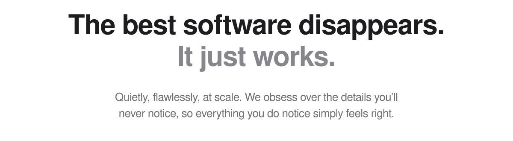
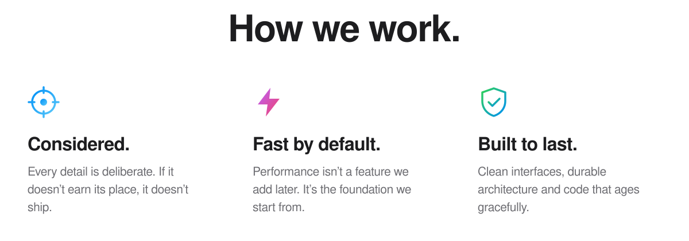

<picture>
  <source media="(prefers-color-scheme: dark)" srcset="./media/hero-dark.svg">
  
</picture>

  

<a href="https://artexsoftware.com"><b>Visit artexsoftware.com&nbsp;&nbsp;›</b></a>

    

<picture>
  <source media="(prefers-color-scheme: dark)" srcset="./media/statement-dark.svg">
  
</picture>

    

<picture>
  <source media="(prefers-color-scheme: dark)" srcset="./media/bento-dark.svg">
  
</picture>

    

<picture>
  <source media="(prefers-color-scheme: dark)" srcset="./media/principles-dark.svg">
  
</picture>

   

<picture>
  <source media="(prefers-color-scheme: dark)" srcset="./media/stack-dark.svg">
  
</picture>

    

<picture>
  <source media="(prefers-color-scheme: dark)" srcset="./media/footer-dark.svg">
  
</picture>

<a href="https://artexagency.com">artex agency</a> 

<a href="https://artexsoftware.com" title="Artex Software - Software Engineering and Development">software</a>
&nbsp;&nbsp;·&nbsp;&nbsp;
<a href="https://artexcreative.com" title="Artex Creative">creative</a>
&nbsp;&nbsp;·&nbsp;&nbsp;
<a href="https://artexcreative.com" title="Artex Creative">creative</a>

